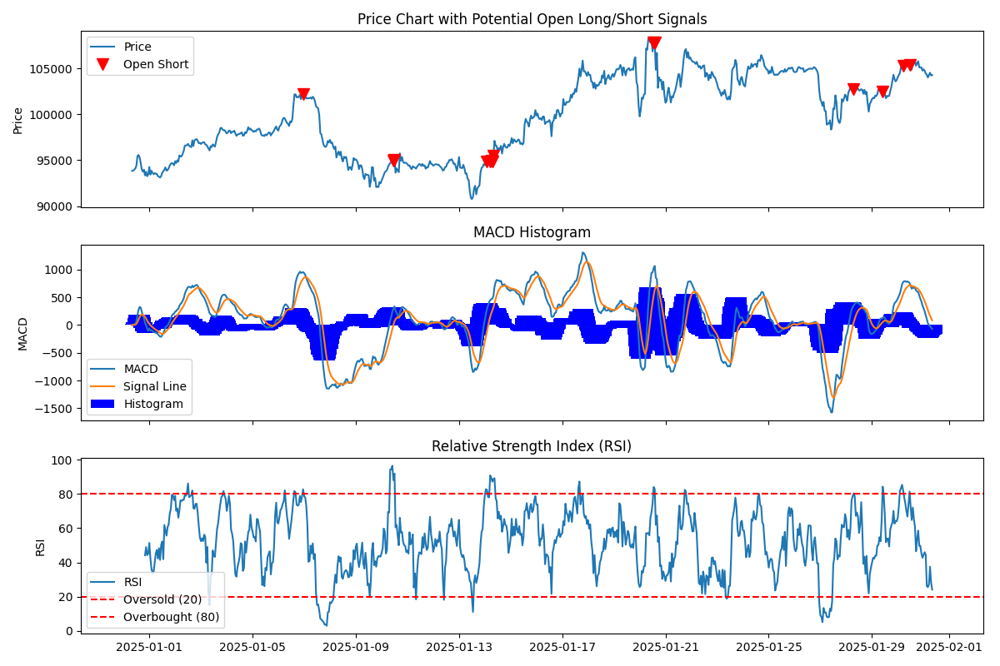

# Automated Cryptocurrency Trading Signal Generator

This project automatically generates trading signals for cryptocurrencies based on technical analysis using MACD divergence and RSI. It fetches historical data from Yahoo Finance, calculates the indicators, and identifies potential long/short entry points.

**Generated Signal Example:**

## How It Works

The script detects regular and hidden bullish/bearish divergences between the price and the MACD histogram, using a configurable threshold to filter out weak signals. A detected divergence signal persists until the following conditions are met:

*   **MACD Histogram Confirmation:**
    *   **Long:** Histogram is negative and starts increasing.
    *   **Short:** Histogram is positive and starts decreasing.
*   **RSI Confirmation:**
    *   **Long:** RSI is below the oversold threshold (default: 30).
    *   **Short:** RSI is above the overbought threshold (default: 70).

Once both conditions are met, a signal is generated and plotted on the price chart.

## Configuration

You can adjust parameters in the script, including the cryptocurrency ticker, data period/interval, MACD settings, divergence threshold, and RSI levels.

## Disclaimer

This project is for educational purposes only and not financial advice. Trading cryptocurrencies involves significant risk. Do your own research and consult with a qualified advisor before making investment decisions.

## Contributing

Contributions are welcome! Feel free to open issues or submit pull requests.
